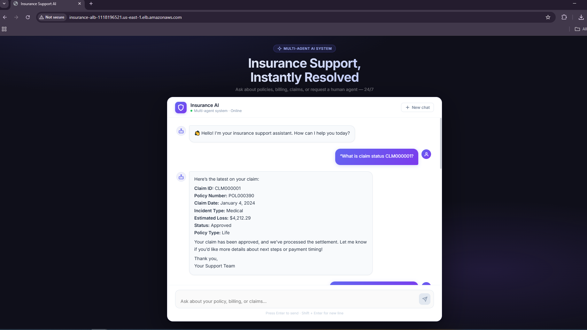
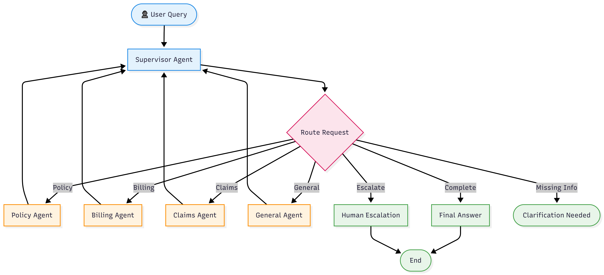

# 🏥 Insurance Support AI

[](https://www.python.org/)
[](https://fastapi.tiangolo.com/)
[](https://reactjs.org/)
[](https://www.docker.com/)
[](https://aws.amazon.com/ecs/)
[](https://github.com/yourusername/insurance-support-ai/actions)

> 🚀 **Production-ready multi-agent AI system** that automates insurance customer support using LLM reasoning, intelligent routing, and semantic search.

## 📺 Usage Demo

<div align="center">
  <video src="docs/video/demo.webm" width="80%" height="80%" controls autoplay muted loop>
    Your browser does not support the video tag.
  </video>
  <p><i>Real-time agent routing and policy retrieval in action.</i></p>
</div>

---

## 📸 Screenshots

### 💬 Chat Interface



### 🧠 Agent Routing Flow



> 📁 Store images inside: `docs/screenshots/`

---

## 🎯 Problem Statement

Insurance support teams handle thousands of repetitive queries daily:

* Policy details
* Claim status
* Billing issues

This leads to:

* ⏳ Slow response times
* 💸 High operational cost
* 😤 Poor customer experience

---

## 💡 Solution

Insurance Support AI solves this using a **multi-agent architecture**:

* A **Supervisor Agent** understands user intent
* Specialized agents handle specific domains
* Data is retrieved from structured + semantic sources
* Responses are generated using LLM reasoning

---

## ✨ Key Features

* 🧠 **Multi-Agent System** (Supervisor → Specialists)
* 🔎 **Semantic Search (ChromaDB)**
* 🗄️ **Structured Data Queries (SQLite)**
* 💬 **Context-Aware Conversations**
* 🔁 **Multi-turn Chat Sessions**
* ⚙️ **Tool Calling (Function-based)**
* 🚨 **Human Escalation Support**
* 🐳 **Dockerized & Cloud Ready**
* ☁️ **Deployed on AWS ECS Fargate**

---

## 🏗️ Architecture Overview

```id="arch01"
Client → ALB → ECS (Frontend + Backend)
        → Multi-Agent System
        → SQLite + ChromaDB (EFS)
        → Groq LLM APIs
```

---

## 🛠️ Tech Stack

| Layer      | Technology                 |
| ---------- | -------------------------- |
| Frontend   | React, Vite, Nginx         |
| Backend    | FastAPI, Python            |
| AI Layer   | LangGraph, LangChain, Groq |
| Database   | SQLite, ChromaDB           |
| DevOps     | Docker, GitHub Actions     |
| Cloud      | AWS ECS, ECR, ALB, EFS     |
| Monitoring | CloudWatch                 |

---

## 🚀 Quick Start

```bash id="qs01"
git clone https://github.com/yourusername/insurance-support-ai.git
cd insurance-support-ai

python -m venv venv
source venv/bin/activate
pip install -r requirements.txt

python scripts/setup_db.py
uvicorn backend.main:app --reload
```

Frontend:

```bash id="qs02"
cd frontend
npm install
npm run dev
```

---

## 📡 API Example

```json id="api01"
POST /api/chat

{
  "message": "What is claim status CLM000001?",
  "session_id": "user-1"
}
```

---

## 🚢 Deployment

### 🔹 Docker

```bash id="dep01"
docker-compose up --build
```

### 🔹 AWS (Production)

* ECS Fargate (Backend + Frontend)
* ALB (Routing)
* ECR (Images)
* EFS (Persistent storage)

### 🔹 CI/CD Pipeline

* GitHub Actions builds Docker images
* Pushes to ECR
* Deploys to ECS automatically

---

## 📊 Monitoring

* AWS CloudWatch (logs & metrics)
* Phoenix (LLM tracing - optional)

---

## 🐛 Troubleshooting

| Issue                | Fix                     |
| -------------------- | ----------------------- |
| Backend not starting | Check `.env`            |
| API not responding   | Verify ECS health check |
| DB errors            | Run setup script        |

---

## 📈 Impact

* ⚡ Reduced response time from **days → seconds**
* 🤖 Automated **80%+ support queries**
* 📉 Reduced operational overhead

---

## 🤝 Contributing

Pull requests are welcome. For major changes, open an issue first.

---

## 📄 License

MIT License

---

## ⭐ Show Your Support

If you found this project useful, give it a ⭐ on GitHub!

---

## 👨‍💻 Author

**Muhammad Hammad**
Software Engineer | Full Stack Developer | AI Engineer

---

**Built with ❤️ using FastAPI, React, LangGraph, and Groq**
